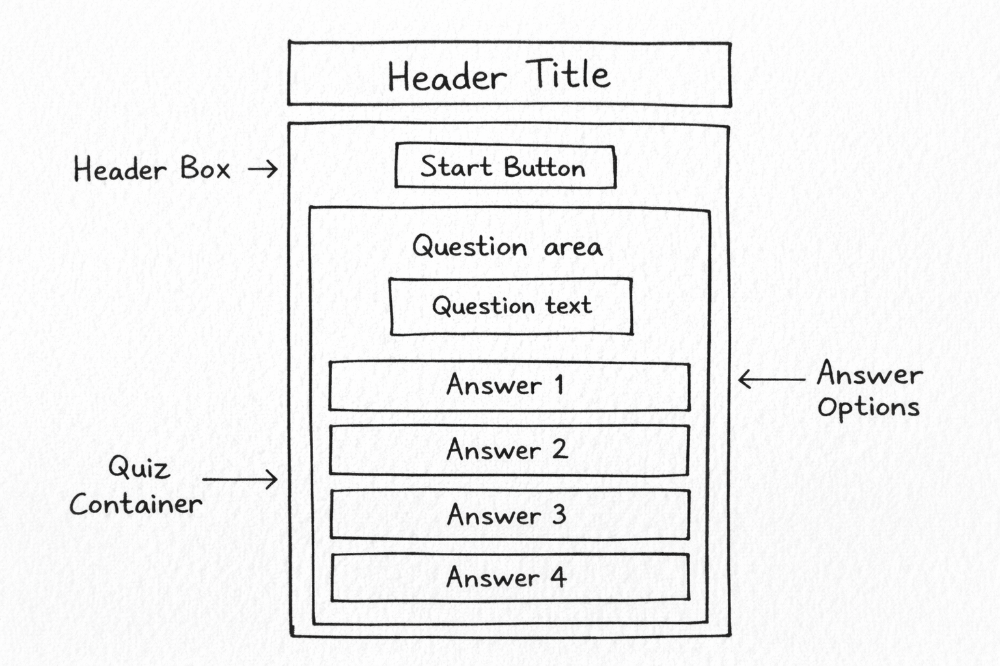

# Interactive English Grammar Quiz

## Quick Navigation
- [Project Overview](#project-overview)
- [User Goals](#user-goals)
- [Target Audience](#target-audience)
- [Site Owner Goals](#site-owner-goals)
- [Features](#features-assessment-breakdown)
- [Technologies Used](#technologies-used)
- [Accessibility Considerations](#accessibility-considerations)
- [Testing](#testing)
- [Challenges Faced & Solutions](#challenges-faced--solutions)
- [Deployment](#deployment)
- [UX & Design Reflection](#ux--design-reflection)
- [Alignment with Assessment Requirements](#alignment-with-assessment-requirements)
- [Credits](#credits)
...

## Project Overview
The Interactive English Grammar Quiz is a browser-based quiz application designed for intermediate-level English learners. Users answer multiple-choice grammar questions, receive immediate feedback, and track their score throughout the quiz.

This project focuses on **JavaScript interactivity, DOM manipulation, and user experience**, aligning with the requirements of **Milestone Project 2 (MS2)**.

---

## User Goals
- Answer intermediate-level English grammar questions  
- Receive immediate feedback on selected answers  
- Track progress and score throughout the quiz  
- View a final result summary upon completion  

---

## Target Audience
- Adult learners of English  
- Intermediate-level English speakers  
- Users looking to refresh or test grammar knowledge  
- Students seeking a simple, interactive learning tool  

---

## Site Owner Goals
- Deliver an engaging and educational quiz experience  
- Demonstrate effective use of JavaScript logic and DOM manipulation  
- Provide a clear, accessible, and responsive user interface  
- Fulfil the **MS2 assessment criteria**  

---

## Features (Assessment Breakdown)

### Must Have
- Start quiz functionality  
- Multiple-choice grammar questions  
- One answer selection per question  
- Immediate visual feedback for correct and incorrect answers  
- Score tracking throughout the quiz  
- Final results screen displaying total score  
- Restart quiz functionality  

### Should Have
- Grammar explanations displayed after each answer  
- Clear question progression (e.g. question order awareness)  
- Disabled answer buttons after selection to prevent multiple inputs  
- Responsive layout for different screen sizes  

### Could Have
- Difficulty level selection  
- Question randomisation  
- Timed questions  
- Expanded question bank  

---

## Technologies Used
- **HTML5** – semantic structure and content  
- **CSS3** – styling, layout, and responsive design  
- **JavaScript (Vanilla JS)** – quiz logic, state management, and interactivity  
- **Git & GitHub** – version control  
- **GitHub Pages** – deployment  

---

## Accessibility Considerations
- Adequate colour contrast for readability  
- Clear visual indicators for correct and incorrect answers  
- Large, clickable buttons suitable for touch devices  
- Semantic HTML to support screen readers  
- Logical focus order and keyboard accessibility where applicable  

---

## Testing

Testing was carried out throughout development to ensure functionality, usability, accessibility, and responsiveness.

### Manual Testing
All quiz functionality was tested manually, including:
- Start quiz and navigation between questions
- Single-answer selection per question
- Correct and incorrect answer feedback with explanations
- Score tracking and final results display
- Restart quiz functionality

Detailed manual testing is documented in the [test.md](test.md) file.

### Validation

The project was validated using the following tools:

- **HTML Validation**:  
  HTML was validated using the W3C HTML Validator with no errors reported.  
  

- **CSS Validation**:  
  CSS was validated using the W3C CSS Validator. Vendor prefix warnings are present due to Autoprefixer usage.
  

- **Autoprefixer**:  
  Autoprefixer was used to add vendor prefixes for improved cross-browser compatibility.  
  

### Responsiveness

The site was tested across multiple screen sizes using Chrome DevTools and the Am I Responsive tool.

### Lighthouse Testing

Lighthouse audits were run in Incognito mode to ensure accurate performance results.  
The site achieved scores above 90 in all categories.

Any issues identified during testing were resolved and retested.
---
## Challenges Faced & Solutions

### Managing Quiz Flow and State
One of the main challenges was managing the quiz flow, particularly ensuring that users could select only one answer per question and move smoothly to the next question. Initially, users were able to interact with multiple answers, which caused inconsistent behaviour. This was resolved by disabling the answer buttons after a selection and controlling screen visibility using JavaScript logic.

### Answer Randomisation
Randomising answer options initially caused issues with checking the correct answer, as relying on fixed indexes was no longer reliable. This was solved by comparing the selected button text with the correct answer string, ensuring accurate validation regardless of the answer order.

### Feedback Display Issues
At an early stage, feedback messages were not displaying correctly and sometimes returned undefined values. This was resolved by ensuring that every question included an explanation property and by maintaining consistent data structure across all questions.

### Styling and Responsiveness
Ensuring the quiz remained clean, readable, and usable on smaller screens required adjustments to spacing, font sizes, and button layout. Media queries and flexible container widths were used to improve responsiveness and provide a consistent experience across devices.

### HTML Semantic Structure Warnings
During HTML validation, warnings were raised indicating that some `<section>` elements lacked appropriate heading content. This could affect accessibility and document structure.

**Fix:**  
Semantic headings were added to each section, and where headings were not intended to be visually displayed, a visually-hidden utility class was applied. This ensured the document remained accessible to screen readers while maintaining the intended visual layout.

**Status:** Resolved

### Lighthouse Performance Variance During Testing
Initial Lighthouse performance scores were inconsistent when tested in a standard browser session due to multiple open tabs and active extensions affecting results.

**Fix:**  
Lighthouse audits were rerun in Incognito mode to eliminate extension interference and background processes, producing more accurate and reliable performance results.

**Status:** Resolved

## Deployment
This project was deployed using **GitHub Pages**.

### Live Site
👉 https://vera-com.github.io/english-grammar-quiz/

### Deployment Steps
1. Push the project to a GitHub repository
2. Navigate to **Settings → Pages**
3. Select the `main` branch and `/ (root)` folder
4. Save to generate the live deployment link

---

## UX & Design Reflection
The user interface is designed to be clean, minimal, and intuitive, with a strong focus on usability rather than visual complexity. Clear typography, consistent spacing, and large buttons were chosen to ensure ease of use across different devices.

Immediate feedback and short grammar explanations were included to help users understand why an answer is correct or incorrect, rather than just showing whether they are right or wrong. This supports learning and encourages users to reflect on their mistakes.

I chose a linear quiz flow to reduce cognitive load and keep users focused on one task at a time. A simple, high-contrast, letter-based favicon was also included to improve tab recognition and maintain visual consistency with my previous projects.

Overall, my design decisions prioritise clarity, readability, and ease of use, helping to keep the quiz accessible and engaging without unnecessary distraction.

### Visual Design & Colour Scheme

A soft, neutral container background was used to keep the focus on the quiz content, while a darker gradient background helps the quiz stand out visually on the page.

Colour is also used to provide clear feedback:
- **Blue** for neutral and unselected answer options
- **Green** to indicate correct answers
- **Orange** to indicate incorrect answers

This colour scheme was chosen to support quick visual recognition, improve usability, and maintain sufficient contrast for accessibility.

### Typography

A clean sans-serif font was used throughout the project to ensure readability across different screen sizes and devices.

Font sizes and spacing were adjusted to:
- Make questions easy to scan
- Ensure buttons are clearly readable and tappable
- Maintain a clear visual hierarchy between headings, questions, and feedback messages

These choices support accessibility and help reduce cognitive load during the quiz.

### Wireframes / Initial Sketch

Initial layout planning was done using a simple hand-drawn sketch to define the structure and user flow of the application before development began.

---

## Alignment with Assessment Requirements
This project was developed with the Milestone Project 2 requirements in mind, focusing on JavaScript-driven interactivity and clear user engagement. The quiz logic is designed to manage state effectively, guide users through a structured flow, and restrict inputs where appropriate to avoid unintended behaviour.

Accessibility and usability were considered throughout development, with attention given to colour contrast, clear feedback, and responsive layout across different devices. Immediate feedback and short grammar explanations were included to support learning rather than simply indicating right or wrong answers.

Overall, this project reflects my current understanding of front-end development concepts introduced in the course, particularly DOM manipulation, event handling, and user-focused design.

---

## Credits
- Code Institute course materials  
- Code Institute MS1 & MS2 student webinar sessions
- Online documentation and references (MDN Web Docs)
