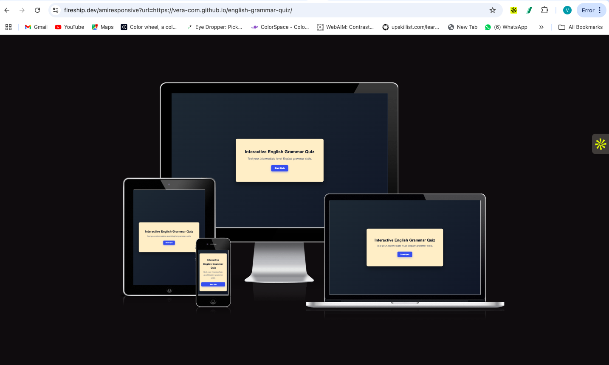
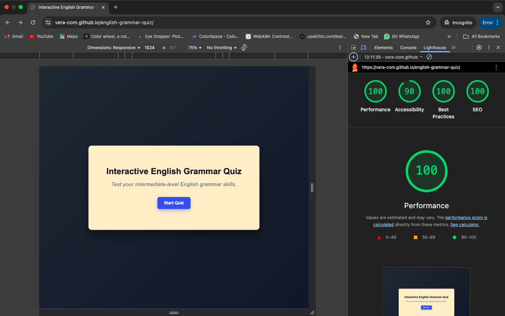
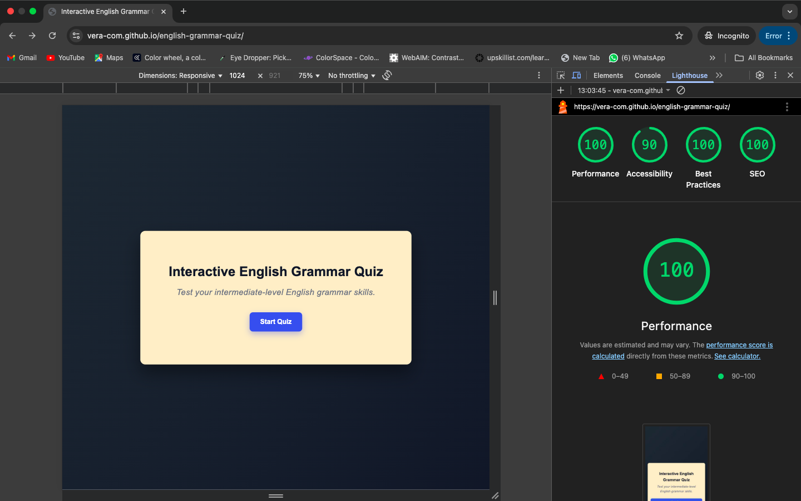
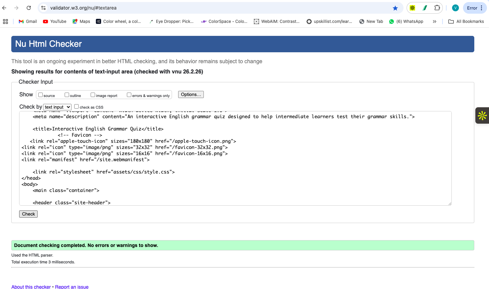
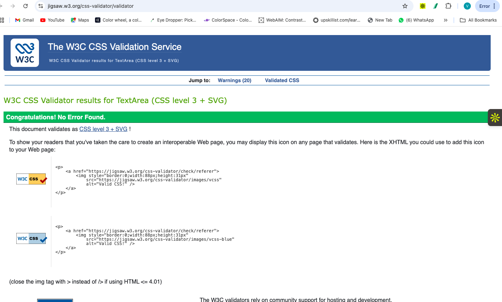
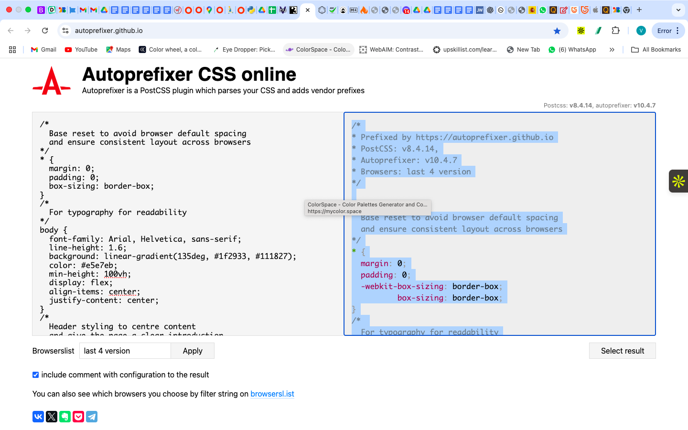

# Testing

This document (test.md) outlines the manual testing, validation, and responsiveness checks that were carried out for the Interactive English Grammar Quiz.

---

## Manual Testing

### Quiz Functionality

| Feature | Expected Outcome | Result |
|------|------------------|--------|
| Start Quiz button | Quiz begins and first question is displayed | Pass |
| Answer selection | Only one answer can be selected per question | Pass |
| Correct answer feedback | Correct answer is highlighted and explanation is shown | Pass |
| Incorrect answer feedback | Incorrect answer is highlighted and explanation is shown | Pass |
| Next Question button | Advances to the next question | Pass |
| Score tracking | Score updates correctly throughout the quiz | Pass |
| Final results screen | Displays final score after last question | Pass |
| Restart Quiz button | Quiz restarts from the beginning | Pass |

---

### User Interface & UX

| Feature | Expected Outcome | Result |
|------|------------------|--------|
| Button states | Buttons disable after selection | Pass |
| Feedback visibility | Feedback text is clearly readable | Pass |
| Progress indicator | Current question number updates correctly | Pass |
| Colour feedback | Green for correct, orange/red for incorrect | Pass |

---

## Responsiveness Testing

The application was tested on multiple screen sizes using Chrome DevTools and Am I Responsive.

## Lighthouse Testing

Lighthouse audits were run in Incognito mode to avoid extension interference.

- Performance: 90–100
- Accessibility: 90+
- Best Practices: 100
- SEO: 100

---

## Browser Testing

| Browser | Result |
|-------|--------|
| Chrome | Pass |
| Firefox | Pass |
| Safari | Pass |

---

## Bugs & Fixes

### Issue: Multiple answers could be selected
- **Cause:** Answer buttons remained active after selection
- **Fix:** Disabled all answer buttons once an answer is selected
- **Status:** Resolved

---

### Issue: Feedback text returned undefined
- **Cause:** Missing explanation property in some question objects
- **Fix:** Added explanation field to all quiz questions
- **Status:** Resolved

---

### Issue: Layout issues on smaller screens
- **Cause:** Fixed container widths and button sizing
- **Fix:** Added media queries and flexible widths
- **Status:** Resolved

---

## Validation

### HTML Validation
- Tool: W3C HTML Validator
- Result: No errors or warnings after semantic heading fixes

### CSS Validation
- Tool: W3C CSS Validator
- Result: No errors found
- Warnings relate to vendor-prefixed properties added by Autoprefixer, which is expected

### Autoprefixer
- Tool: Autoprefixer CSS Online
- Purpose: Improve cross-browser compatibility by adding vendor prefixes

